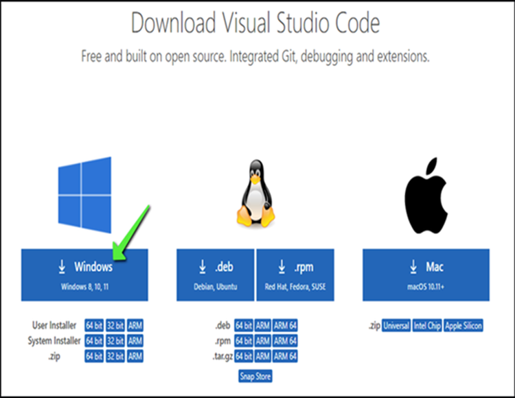
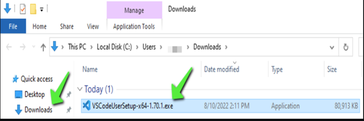
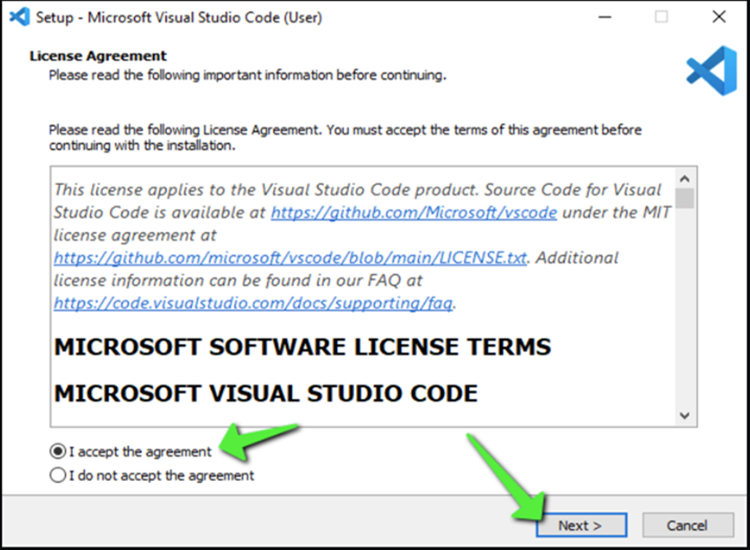
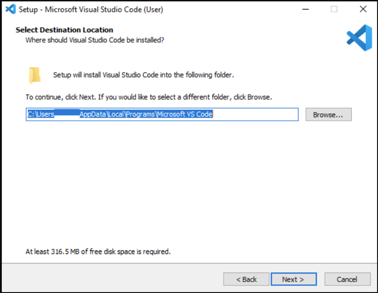
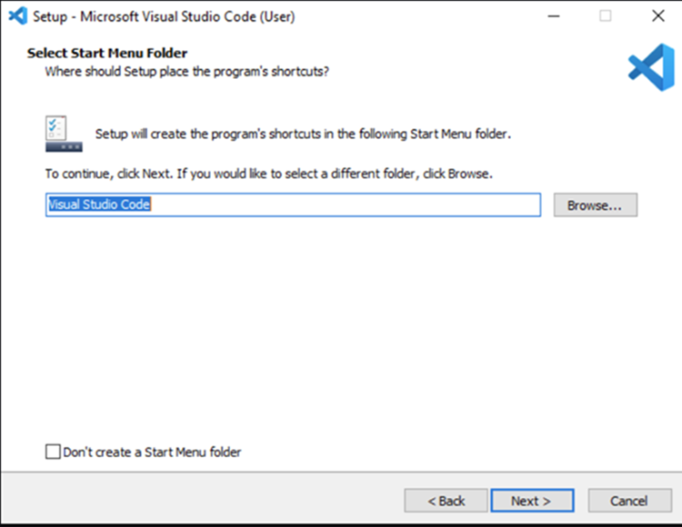
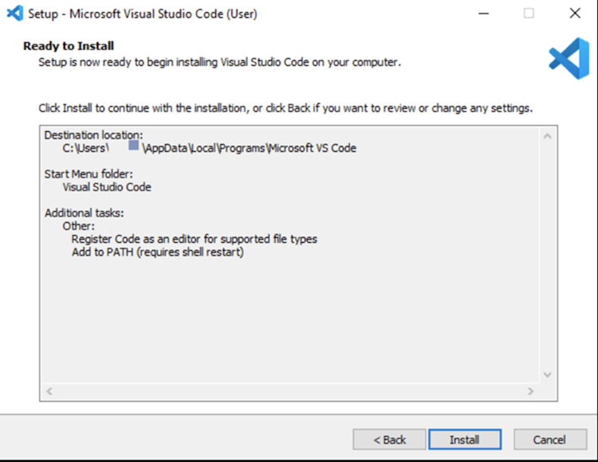
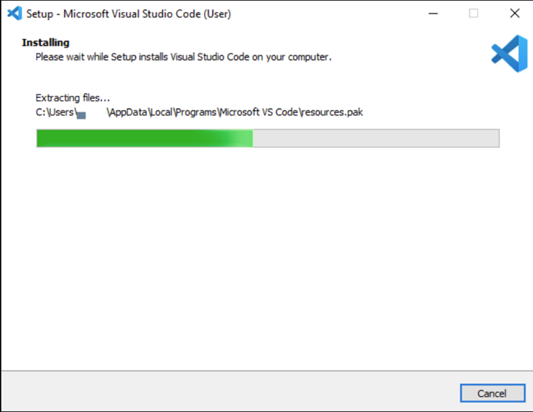
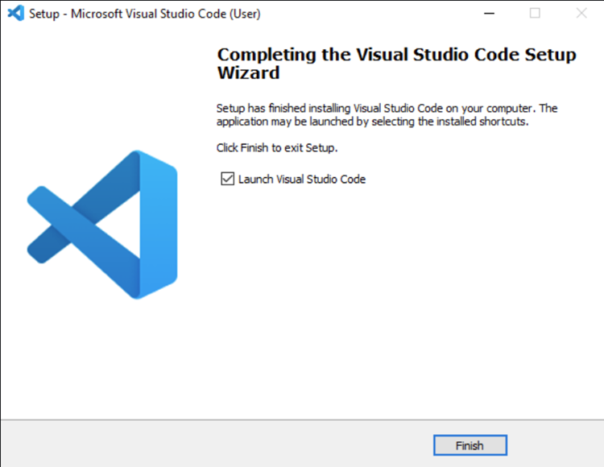
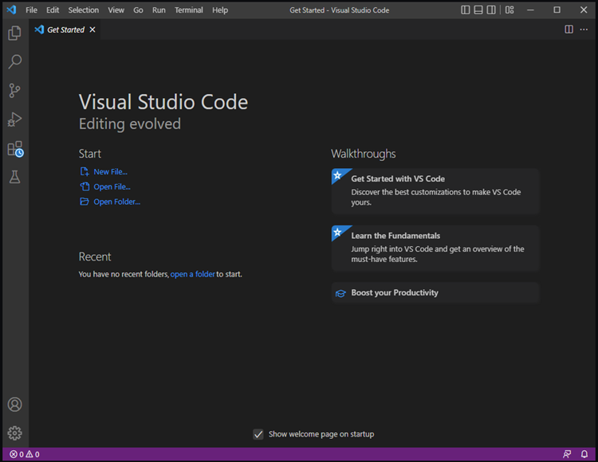
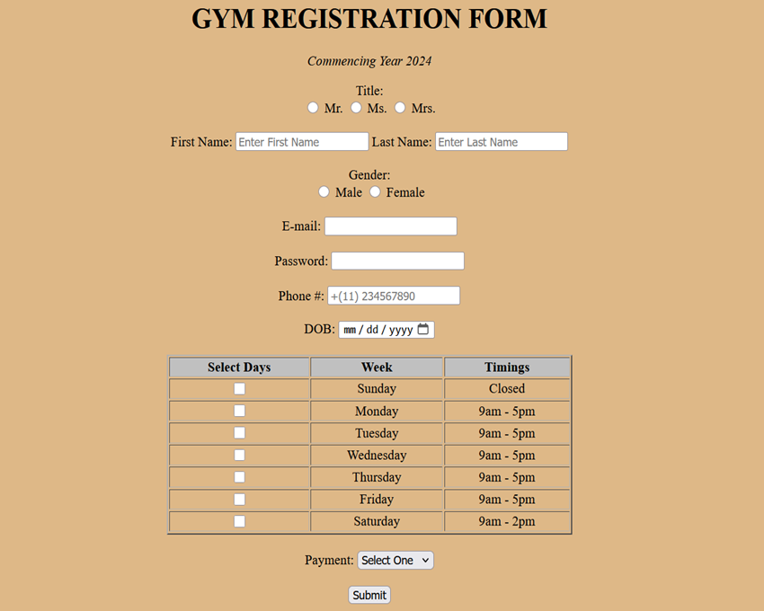

# HTML-Form

Code for creating an Online-Form using HTML 😄

# What we will learn in this lessom

- How to create _Heading_ in html
- How to create _Italic Text_ in html
- Essential **`<input>` Element** for html-form
- Creating _radio-buttons & check-boxes_
- Creating text-box for password, phone and date/calendar
- How to create _Table_ using html
- How to create a _Drop-Down-Selection-Box_
- How to create a _Submit button_

# Extensions we need are

- _'Live Server'_ by Ritwick Dey

# Preferred Code Editor

- If you are new to code, I would recommend to use _'Visual Studio Code'_
- **Installing VS Code:**
  Navigate to the link: https://code.visualstudio.com/download
  Click on blue Windows button to start Download.



- Once downloaded, go to 'Downloads' in your device and double-click 'VSCodeUserSetup-x64-1.x.x.exe' file.



- Installation process begins, first accept the License Agreement, then click 'Next'



- Accept the default location and click 'Next'



- In '_Select Start Menu Folder_' window, click 'Next'



- **'Select Additional Tasks'** window will open, check All boxes, click 'Next'

- In '_Ready To Install_ ' window, click 'Next'



- Installation in Progress:



- Click 'Finish' to exit installation.



- Click on the **'Start Menu'** on Desktop, and type '_Visual Studio Code_' or simply '_vscode_' and press **Enter**

- Visual Studio Code will launch



# Our Program 👻

- HTML Structure

```html
<!DOCTYPE html>
<html lang="en">
  <head>
    <meta charset="UTF-8" />
    <meta name="viewport" content="width=device-width, initial-scale=1.0" />
    <title>Document</title>
  </head>
  <body></body>
</html>
```

- The above code contains the structure of a 'html-page'. This code is _mandatory!_ Any further code we'll add to create a webpage falls within this code structure.

# For our main entry code 💻

```html
<!DOCTYPE html>
<html lang="en">
   <head>
      <meta charset="utf-8">
      <meta name="viewport" content="width=device-width, initial-scale=1.0">
      <title>Membership Registration Form</title>
      <style>
         body {
	         background-color: burlywood;
         }
      </style>
   </head>
   <body>

      <div align="center">
   <main>
      <h1> <center> GYM REGISTRATION FORM <center> </h1>
      <p> <em> <center> Commencing Year 2024 </center> </em> </p>
      <form action="action_page.php" method="post">
         <div>
            <label align="center">Title:</label><br>
            <label> <input type="radio" value="Mr." name="title" > Mr. </label>
            <label> <input type="radio" value="Ms." name="title"> Ms. </label>
            <label> <input type="radio" value="Mrs." name="title"> Mrs. </label>
         </div>

         <br>

         <div>
            <label for="fname">First Name:</label>
            <input type="text" id="fname" placeholder="Enter First Name" required>

            <label for="lname">Last Name:</label>
            <input type="text" id="lname" placeholder="Enter Last Name" required>
         </div>

         <br>

         <div>
            <label>Gender:</label><br>
            <label> <input type="radio" id="Male" name="gender"> Male </label>
            <label> <input type="radio" id="fmale" name="gender"> Female </label>
         </div>

         <br>

         <div>
            <label for="email">E-mail:</label>
            <input type="email" id="email" name="email" required>
         </div>

         <br>

         <div>

            <label for="pass">Password:</label>
            <input type="password" id="pass" name="pass" maxlength="12" required>


         </div>

         <br>

         <div>
            <label for="phone">Phone #:</label>
            <input type="tel" id="phone" name="phone" placeholder="+(11) 234567890">

         </div>

         <br>

         <div>
            <label for="DOB">DOB:</label>
            <input type="date" id="DOB" name="bdate">

         </div>
         <br>
         <div>
            <table border="2" width="500px">
               <tr>
                  <th bgcolor="silver">Select Days</th>
                  <th bgcolor="silver">Week</th>
                  <th bgcolor="silver">Timings</th>
               </tr>
               <tr align="center">
                  <td> <input type="checkbox" value="sunday"> </td>
                  <td>Sunday</td>
                  <td>Closed</td>

               </tr>
               <tr align="center">
                  <td><input type="checkbox" value="monday"></td>
                  <td>Monday</td>
                  <td>9am - 5pm</td>
               </tr>
               <tr align="center">
                  <td><input type="checkbox" value="tuesday"></td>
                  <td>Tuesday</td>
                  <td>9am - 5pm</td>
               </tr>
               <tr align="center">
                  <td><input type="checkbox" value="wednesday"></td>
                  <td>Wednesday</td>
                  <td>9am - 5pm</td>
               </tr>
               <tr align="center">
                  <td><input type="checkbox" value="thursday"></td>
                  <td>Thursday</td>
                  <td>9am - 5pm</td>
               </tr>
               <tr align="center">
                  <td><input type="checkbox" value="friday"></td>
                  <td>Friday</td>
                  <td>9am - 5pm</td>
               </tr>
               <tr align="center">
                  <td><input type="checkbox" value="saturday"></td>
                  <td>Saturday</td>
                  <td>9am - 2pm</td>
               </tr>

            </table>
            </div>

            <br>

            <div>
               <label for="payment">Payment:</label>
               <select id="payment" name="payment">
                  <option value="nil">Select One</option>
                  <option value="visa">visa</option>
                  <option value="mastercard">mastercard</option>
                  <option value="giftcard">giftcard</option>

               </select>
            </div>

            <br>

            <div>
               <input type="Submit" value="Submit">
            </div>
         </form>
      </main>
   </div>
</body>
</html>
```

# Output for the above code



# Summary

- That's how you can create an '_Online-Form_' including features like:
  Radio Button
  Check Boxes
  Set Password
  Calendar/Date Selector
  Table &
  Submit Form Button
